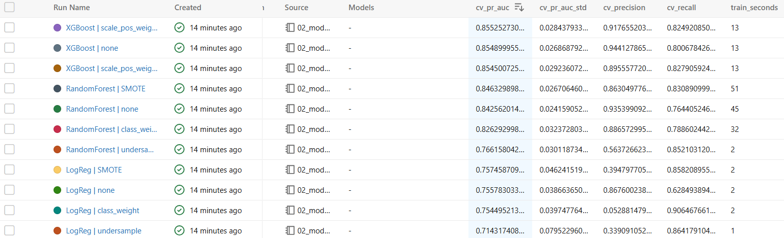
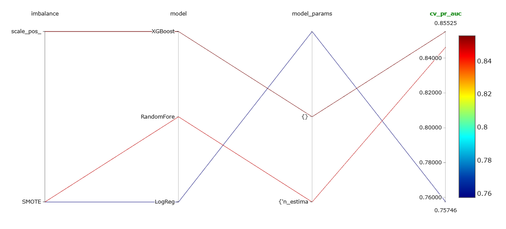
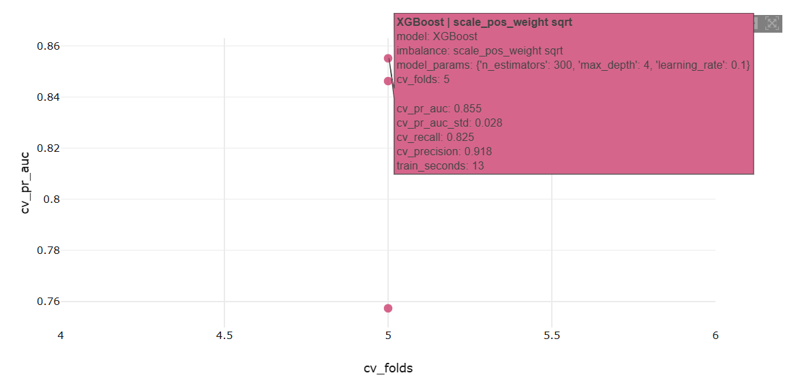

# Credit Card Fraud Detection

An end-to-end machine learning project that detects fraudulent credit card transactions, from data cleaning to an API deployed with Docker.

## Problem

Card fraud costs banks and customers billions every year, and fraudulent transactions are extremely rare (about 0.17% of all transactions). The goal is to flag suspicious transactions automatically while blocking as few legitimate customers as possible.

## Dataset

[Credit Card Fraud Detection](https://www.kaggle.com/datasets/mlg-ulb/creditcardfraud) (ULB Machine Learning Group): 284,807 European card transactions over two days, 492 of them fraud. Features V1-V28 are anonymized (PCA); Time, Amount and Class are not.

## Progress

- [x] Step 1: data cleaning, exploration, splits, baseline
- [x] Step 2: models and imbalance handling
- [ ] Step 3: tuning, threshold, explainability
- [ ] Step 4: API, Docker, tests, CI

## Data findings

- Removed 1081 duplicate rows, leaving 283726 transactions (473 frauds).
- Stratified 70/15/15 split: train 198608, validation 42559, test 42559 rows. The fraud rate is about 0.17% in each.
- Amount is heavily skewed, so I added a log-transformed version. Fraud amounts are not clearly higher than normal ones.
- V17, V14, V12 and V10 are the features that differ most between fraud and normal transactions.
- A "never fraud" baseline gets 99.833% accuracy but 0% recall and a PR-AUC of about 0.0017, so accuracy is not a useful metric here. I use PR-AUC and recall.

## How to reproduce

1. Download creditcard.csv from Kaggle and put it in data/raw/
2. Install the requirements: python -m pip install -r requirements.txt
3. Prepare the data: python -m src.data
4. Run the tests: python -m pytest

## Model Comparaison (5-fold CV on the training set)

| Model | Imbalance strategy | PR-AUC (mean ± std) | Recall @0.5 | Precision @0.5 |
|---|---|---|---|---|
| XGBoost | scale_pos_weight sqrt | 0.855 ± 0.028 | 0.825 | 0.918 |
| XGBoost | none | 0.855 ± 0.027 | 0.801 | 0.944 |
| XGBoost | scale_pos_weight full | 0.855 ± 0.029 | 0.828 | 0.896 |
| RandomForest | SMOTE | 0.846 ± 0.027 | 0.831 | 0.863 |
| RandomForest | none | 0.843 ± 0.024 | 0.764 | 0.935 |

Best model: **XGBoost**, PR-AUC ~0.855, far above the 0.0017 "never fraud" baseline.
Accuracy isn't used as a metric, since a model that never flags fraud already scores 99.8%.
All 11 experiments were tracked with MLflow.

